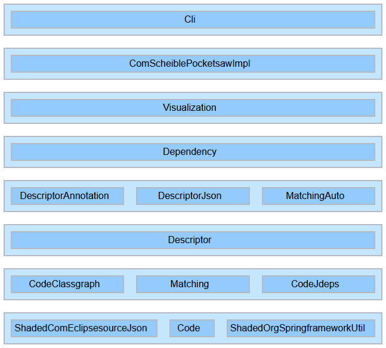

[adding-uses-workflow]: adding-uses-workflow.gif "Adding of uses relations"
[pocketsaw-package-group-structure]: pocketsaw-package-group-structure.png "Pocketsaw package group structure"
[pocketsaw-layered-sub-modules]: pocketsaw-layered-sub-modules.png "Pocketsaw layered sub-modules"
[angular-tour-of-heroes-dependencies]: angular-tour-of-heroes-dependencies.png "Angular Tour of Heros Dependencies"
[disid-multimodule-spring-boot]: disid-multimodule-spring-boot.png "DISID Spring Boot Multimodule"
[pocketsaw-used-sub-module-types]: pocketsaw-used-sub-module-types.png "Pocketsaw used sub-module types"
[threejs-es6-modules]: threejs-es6-modules.png "three.js ES6 Modules"
[unit-test-es6-modules-dependency-graph]: unit-test-es6-modules-dependency-graph.png "Unit Test ES& Modules Dependency Graph"

# Pocketsaw

Compile time sub-module system, aimed at package group dependency organization within a Maven project resp. Java 9 module (and even more, see for example [Using Pocketsaw in an Angular project](#using-pocketsaw-in-an-angular-project)).

## Motivation

Package cycles are bad.
Especially between packages on the same level.
They make the codebase harder to change (if A depends on B and vice versa, then changing A would most likely require to also change B and both will be effectively one thing) and understand.

That package cycles should be avoided is an open secret (see [SEI CERT Oracle Coding Standard for Java
SEI CERT Oracle Coding Standard for Java at Carnigen Mellon Software Engineering](https://wiki.sei.cmu.edu/confluence/display/java/DCL60-J.+Avoid+cyclic+dependencies+between+packages)).
But as for example Jens Schauder mentions in his [blog entry](http://blog.schauderhaft.de/2011/07/17/breaking-dependency-cylces/) the awareness among developers seems not to be that high.
[This awesome article](https://dzone.com/articles/structure-spring-core) sheds some light on the internal package organization of the Spring Framework.
It shows that the Spring guys really take care of their dependencies (in contrast to other as well shortly mentioned Open Source projects).
And this was the main motivation for creating Pocketsaw: Having an easy and lightweight tool to model and check the internal package structure.

The following image shows the Pocketsaw package group structure.
Yellow boxes are sub-modules while the blue ones are external functionalities.
The gray ones are a special case, they represent the shaded libraries which are modeled as sub-modules because they are part of the codebase (see [Shaded dependencies](#shaded-dependencies)).
In case of a not allowed code dependency there would be a red arrow whilst in case of a defined but not used in the code dependency a gray arrow would be displayed.

![pocketsaw-package-group-structure]

Since version 1.2.0 there is an additional visualization available.
In the layered sub modules view all allowed dependencies go from top to bottom.
Horizontal or bottom to top dependencies are not allowed and marked red.

![pocketsaw-layered-sub-modules]

In version 1.3.0 the used types per sub-module are available as a visualization.
They represent the API exposed to other sub-modules.
If a sub-module exposes many types its API is rather wide and might cause maintainability problems in the future.

![pocketsaw-used-sub-module-types]

## Background

Highly inspired by the awesome [Jabsaw](https://github.com/ruediste/jabsaw) project.
And yes, pocketsaw instead of jabsaw (which is already a smaller jigsaw) is an intended pun. ;-)

The main differences are:

- visualization with a HTML template using vis.js (instead of graphviz/dot)
- default source of code/package dependency information is the completely underrated [jdeps](https://docs.oracle.com/javase/8/docs/technotes/tools/unix/jdeps.html) command-line tool of the JDK (instead of the ASM library)
  - starting with version 1.4.0 [ClassGraph](https://github.com/classgraph/classgraph) can also be used for collecting dependency information from the classpath (with `Pocketsaw.analizeClasspath(...)`)
- package groups within the Maven project (resp. Java module) are called sub-module (instead of module to avoid name collision [Java Platform Module System](http://openjdk.java.net/projects/jigsaw/spec/))
- package groups outside the Maven project are called external functionality

## Installation

The Maven artifacts can't be found in an official repository yet ([JitPack](https://jitpack.io) usage is pending until [this issue](https://github.com/jitpack/jitpack.io/issues/2872) is resolved).

For building locally these are the prerequisites:

1. at least JDK 8
1. a recent Maven
1. `mvn clean install` of [javascript-es2020-parser 0.5.1](https://github.com/janScheible/javascript-es2020-parser/tree/0.5.1)

And then `mvn clean install` in the working directory of this repository.

## Workflow for using Pocketsaw in a Java project

### Adding of Maven dependency

Add

```xml
<dependency>
    <groupId>com.scheible.pocketsaw.impl</groupId>
    <artifactId>pocketsaw-impl</artifactId>
    <version>1.7.0</version>
    <scope>test</scope>
</dependency>
```

to project.

If not a Spring based project add

```xml
<dependency>
    <groupId>io.github.classgraph</groupId>
    <artifactId>classgraph</artifactId>
    <version>4.8.90</version>
    <scope>test</scope>
</dependency>
```

as well.
Currently [ClassGraph](https://github.com/classgraph/classgraph) and its predecessor [FastClasspathScanner](https://github.com/lukehutch/fast-classpath-scanner) are the supported classpath scanners.
A custom one can simply be used by extending the class `com.scheible.pocketsaw.impl.descriptor.ClasspathScanner` and using any already available classpath scanning facilities (for example the [Reflections](https://github.com/ronmamo/reflections) library).

ClassGraph plays a dual role because it also provides dependency scan facilities (by extending `DependencyAwareClasspathScanner`) and can be used with `Pocketsaw.analizeClasspath(...)` that was introduced in version 1.4.0 of Pocketsaw.

### Execution of Pocketsaw in the build

Create a unit test like:

```java
public class PocketsawSubModulesTest {

    private static Pocketsaw.AnalysisResult result;

    @BeforeClass
    public static void beforeClass() {
        result = Pocketsaw.analizeCurrentProject(SpringClasspathScanner.create(PocketsawSubModulesTest.class));
    }

    @Test
        public void todo() {
    }
}
```

It is assumed that the test class is created in the root package of the project because classpath scanning will start with the package of the class used for classpath scanner creation.
For non Spring projects use `FastClasspathScanner.create(...)` and for Spring based ones `SpringClasspathScanner.create(...)`.

To use `Pocketsaw.analizeClasspath(...)` ClassGraph is required.
Neither `SpringClasspathScanner` nor `FastClasspathScanner` provide a dependency scan.
To make all project classes available on the classpath the `PocketsawSubModulesTest` has to be placed in the main project that includes all other sub-projects as dependencies.
Then the base package has to defined as a string (even if the test is defined in a package like `com.domain.project.app`):

```java
public static void beforeClass() {
    result = Pocketsaw.analizeClasspath(
            ClassgraphClasspathScanner.create("com.domain.project"));
}
```

#### Auto matching

Since version 1.6.0 auto matching is available.
It can be enabled with `enableAutoMatching()` called on the `ClasspathScanner` implementation.
Sub-module and external functionality descriptors are generated automatically if they are not explicitly defined.
For sub-modules sub packages are never included.
If this is not the desired behavior for some packages a corresponding `@SubModule` has to be defined explicitly.

In the following the structure of Pocketsaw is visualized with auto matching enabled:


### Explicit matching of packages with sub-modules and external functionalities

Add `@SubModule` and `@ExternalFunctionality` annotated classed until every package is matched and the unit test passes.
In case of not yet matched package a error message like `UnmatchedPackageException: The package 'com.scheible.pocketsaw.impl.visualization' was not matched at all!` is displayed and either a sub-module or an external functionality has to be added.

`@SubModule` annotated classes have to be either placed in the root package of the sub-module it describes or in any arbitrary package with `basePackageClass` set.
Setting `basePackageClass` is for example needed if a sub-module of another project is declared when `Pocketsaw.analizeClasspath(...)` is used.

The default is that all sub-packages are include as well but this behavor can be override by `includeSubPackages = false`.
For external functionalities a package match pattern has to specified.
The syntax supports Ant style pattern (e.g. `com.test.*` matches all classes in the `com.test` package and `com.test.**` matches the classes in the sub-packages too).

The following conventions might be used:

- `@SubModule` annotated classes have the suffix `SubModule`.

  ```java
  package com.scheible.pocketsaw.impl.visualization;

  /**
   * Sub-module for visualizing the dependency graph.
   */
  @SubModule
  public class VisualizationSubModule {
  }
  ```

  In case sub-modules of other projects (the style is identical to the following external functionalities):

  ```java
  public class SubModules {

      @SubModule(basePackageClass = SharedCodeBasePackageClass.class)
      public static class SharedCodeLibrary {
      }
  }

  ```

- `@ExternalFunctionality` are collected as inner static classes in a class called `ExternalFunctionalities` in the root package of the project.

  ```java
  package com.scheible.pocketsaw.impl;

  public class ExternalFunctionalities {

      @ExternalFunctionality(packageMatchPattern = {"org.springframework.context.**", "org.springframework.beans.**"})
      public static class Spring {
      }
  }
  ```

As soon as all packages are matched the dependency graph HTML is generated.
It can be found in `./target/pocketsaw-dependency-graph.html`.
The full path is also printed on standard out while analyzing the project.

### Definition of the allowed sub-module dependencies

After every package is matched, uses relations have to be added to the sub-modules until all arrows are green.
Uses relations are defined in the `@SubModule` annotation like `@SubModule({SpringBeans})` or `@SubModule(includeSubPackages = false, uses = {{SpringBeans})` in case of multiple values.

The following sequence illustrates that process:
![adding-uses-workflow]

### Automatic enforcement of allowed dependencies

To make sure that the sub-modules and their dependencies are verify automatically replace the `todo()` test with:

```java
@Test
public void testNoDescriptorCycle() {
    assertThat(result.getAnyDescriptorCycle()).isEmpty();
}

@Test
public void testNoCodeCycle() {
    assertThat(result.getAnyCodeCycle()).isEmpty();
}

@Test
public void testNoIllegalCodeDependencies() {
    assertThat(result.getIllegalCodeDependencies()).isEmpty();
}
```

In this example [AssertJ](http://joel-costigliola.github.io/assertj/) is used and displays nice error messages in case of one of the asserts is violated.

In the future the unit test might fail when new packages or additional libraries are added.
The approach described in [Matching of all packages with sub-modules and external functionalities](#matching-of-all-packages-with-sub-modules-and-external-functionalities) is used then.

It might also fail if one of the asserts are violated.
In this case either the code has to be fixed to remove the not allowed code dependency or an additional usage relation has to be added like described in [Definition of the allowed sub-module dependencies](#definition-of-the-allowed-sub-module-dependencies).

## Using Pocketsaw in an Angular project

Since version 1.1.0 of Pocketsaw in addition to Java-only projects it can be used for asserting the sub-module structure of projects containing an Angular frontend as well.

The first step is to install Dependency Cruiser with `npm install --save-dev dependency-cruiser`.
Next it is easiest to add the following to the `scripts` section of the `package.json`:

```json
"dependencies": "dependency-cruise --ts-pre-compilation-deps -T json --exclude \"^node_modules\" src > dependencies.json"
```

Pocketsaw can then be run via the CLI:

```
java -jar pocketsaw-1.7.0.jar sub-module.json dependencies.json dependency-cruiser pocketsaw-dependency-graph.html --ignore-illegal-code-dependencies
```

### Angular Tour Of Heros Example

In the following the structure of an [Angular Tour Of Heroes](https://github.com/rpoitras/angular-tour-of-heroes) example is visualized:

![angular-tour-of-heroes-dependencies]

The good news is that the "children" of `App` have no dependencies with their siblings at all.
Also, the two-way relation between them and `App` could perhaps easily be resolved by moving `HeroService` and `MessageService` to dedicated sub-directories and therefore sub-modules.

## Using Pocketsaw with a Spring Boot JAR

Since version 1.3.0 there is also support for analyzing Spring BOOT JARs "from the outside".
That means instead of using annotations in the code an external `sub-module.json` is used.
The use case is to analyze an unmodified code base that does (not yet) use Pocketsaw.

```
java -jar pocketsaw-1.7.0.jar sub-module.json target/spring-boot-app.jar spring-boot-jar:root-packages=sample.multimodule target/pocketsaw-dependency-graph.html --ignore-illegal-code-dependencies
```

### Spring Boot Multimodule Example

In the following the structure of a [Spring Boot Multimodule](https://github.com/DISID/disid-proofs/tree/master/spring-boot-multimodule) project is visualized:

![disid-multimodule-spring-boot]

## Using Pocketsaw in a ES6 JavaScript project

Since version 1.5.0 of Pocketsaw ES6 JavaScript projects are natively supported.
That means Dependency Cruiser is not required and therefore no Node.js installation at all is needed.

```
java -jar pocketsaw-1.7.0.jar sub-module.json ./src es6-modules:print-bundle-report=true pocketsaw-dependency-graph.html
```

Or invocation in a Java unit test:
```java
final Es6ModulesSource es6ModulesSource = new Es6ModulesSource();

result = Pocketsaw.analize(new File("./src/main/frontend/sub-modules.json"),
        es6ModulesSource.read(new File("./src/main/frontend"), printBundleReport(new HashSet<>())),
        Optional.of(new File("./target/pocketsaw-frontend-dependency-graph.html")));
```

### ES6 JavaScript modules example

In the following the structure of the [Three.js 3D library](https://github.com/mrdoob/three.js) is visualized:

![threejs-es6-modules]

### Bundle Report

The bundle report is an experimental analysis of frontend code.
It searches for a single sub-module with only outgoing dependencies.
This sub-module is treated as the root of the dependency graph.
Every dynamic `import` in the graph is then the entry point of a lazy loaded route and therefor starts a bundle.
All sub-modules that belong to more than a single bundle are assigned to the default bundle.

In case of multiple sub-modules with only outgoing dependencies there is since version 1.5.2 also an option available to choose a root sub-module explicitly.
`Es6ModulesSource.ParameterBuilder.startModule(...)` is passed as a parameter to `es6ModulesSource#read(...)`.

The following example sub-module dependency graph from the unit tests results in the bundle report shown under the graph.

![unit-test-es6-modules-dependency-graph]

```
Module bundle report:
 * app                    *default*
 * button                 first-page-bundle
 * first-page             first-page-bundle
 * first-page-component   first-page-bundle
 * label                  *default* (second-page-bundle, first-page-bundle)
 * router                 *default*
 * second-page            second-page-bundle
 * second-page-component  second-page-bundle
 * util                   *default* (second-page-bundle, first-page-bundle)
```

The final bundled app has then 3 bundles: `*default*` (which is loaded eagerly) and 2 lazy loaded ones (`first-page-bundle` and `second-page-bundle`).

## Using Pocketsaw with esbuild

Since version 1.7.0 of Pocketsaw [esbuild](https://esbuild.github.io/api/#metafile) metadata as dependency source is supported.
The `--metafile` flag of esbuild can be used to generate a metadata file.

```
java -jar pocketsaw-1.7.0.jar sub-module.json ./target/esbuild-metadata.json esbuild-metadata pocketsaw-dependency-graph.html
```

Or invocation in a Java unit test:
```java
final EsBuildMetadata esBuildMetadata = new EsBuildMetadata();

result = Pocketsaw.analize(new File("./src/main/frontend/sub-modules.json"),
        esBuildMetaData.read(new File("./target/esbuild-metadata.json")),
        Optional.of(new File("./target/pocketsaw-frontend-dependency-graph.html")));

## CLI

Since version 1.1.0 there is CLI support available via the `com.scheible.pocketsaw.impl.cli.Main` class.

```
usage: pocketsaw <sub-module.json> <dependencies.file> {dependency-cruiser|spring-boot-jar|es6-modules|esbuild-metadata} <pocketsaw-dependency-graph.html> [--ignore-illegal-code-dependencies] [--auto-matching] [--verbose]

options:
  --ignore-illegal-code-dependencies   Does not fail in case of illegal code dependencies.
  --auto-matching                      Enables auto matching (<sub-module.json> is optional then).
  --verbose                            Print detailed information.
```

Dependency information sources might require specific parameters to be passed.
The format for that is `dependency-source:foo=bar:value=42`.

### Sub-modules descriptors

For CLI usage the sub-modules descriptors are read from a JSON file.
The file format looks like this:

```json
{
  "autoMatching": false,
  "subModules": [
    {
      "name": "First",
      "packageName": "project.first",
      "includeSubPackages": false,
      "color": "red"
    },
    {
      "name": "FirstChild",
      "packageName": "project.first.child",
      "uses": ["First"]
    }
  ],
  "externalFunctionalities": [
    {
      "name": "Spring",
      "packageMatchPattern": [
        "org.springframework.beans.**",
        "org.springframework.context.**"
      ]
    },
    {
      "name": "Guava",
      "packageMatchPattern": "com.google.common.**"
    }
  ]
}
```

- auto matching
  - enables auto matching (`false` is the default)
- sub-modules
  - `uses` with `[]` as default
  - `includeSubPackages` with default same as `@SubModule#includeSubPackages` (`true`)
  - `color` with default same as `@SubModule#color` (`orange`)
- external functionalities (optional, depends on specific dependency source if supported)
  - `packageMatchPattern` either a single string or an array

### Third-party dependencies information source

To add an third-party dependency information source the interface [`PackageDependencySource`](pocketsaw-impl/src/main/java/com/scheible/pocketsaw/impl/code/PackageDependencySource.java) has to be implemented in an separated Maven project.
Pocketsaw then uses JDK's `ServiceLoader` to find and load the dependency source.
Therefore a no-args constructor is mandatory.
For an example of such an implementation see the one of [Dependency Cruiser](pocketsaw-dependecy-cruiser).

#### Dependency Cruiser dependency information source

No parameters supported.

**NOTE**: For now the reported dependencies are limited to TypeScript files excluding all `*.spec.ts`.

**NOTE**: Currently no external functionalities are supported.

#### Spring Boot JAR dependency information source

Required parameters:

- `root-packages`: Comma-separated list of root packages

Optional parameters:

- `keep-temp-dir-contents`: Skips deletion of used temp directory
- `temp-dir-name`: Custom temp directory name instead of random UUID

#### ES6 Modules dependency information source

Optional parameters:

- `print-bundle-report`: Boolean parameter for printing the bundle report to the console
- `start-module`: Root sub-module for the bundle report

#### esbuild metadata dependency information source

Optional parameters:

- `root-package-alias`: Alternative name for the root package (can be used to for example rename a `src` directory to a more application specific package name)

### Maven usage

To automated Pocketsaw execution in a Maven project with an Angular frontend the `exec-maven-plugin` can be use like this:

```xml
<plugin>
	<groupId>org.codehaus.mojo</groupId>
	<artifactId>exec-maven-plugin</artifactId>
	<version>1.6.0</version>
	<executions>
		<execution>
			<id>pocketsaw</id>
			<goals>
				<goal>exec</goal>
			</goals>
			<phase>verify</phase>
			<configuration>
				<executable>java</executable>
				<classpathScope>test</classpathScope>
				<arguments>
					<argument>-classpath</argument>
					<classpath/>
					<argument>com.scheible.pocketsaw.impl.cli.Main</argument>
					<argument>${project.basedir}/pocketsaw-sub-modules.json</argument>
					<argument>${project.basedir}/target/dependency-cruiser-dependencies.json</argument>
					<argument>dependency-cruiser</argument>
					<argument>${project.basedir}/target/pocketsaw-dependency-graph.html</argument>
					<argument>--verbose</argument>
				</arguments>
			</configuration>
		</execution>
	</executions>
</plugin>
```

### CLI exit codes

The CLI uses the following exit codes to allow easy scripting:

| exit code | description                                              |
| --------- | -------------------------------------------------------- |
| -1        | unexpected fatal error                                   |
| 1         | no package dependency source was found on classpath      |
| 2         | wrong arguments                                          |
| 3         | also wrong arguments (for backwards compatibility only)  |
| 4         | found a descriptor cycle                                 |
| 5         | found a code cycle                                       |
| 6         | found illegal code dependencies                          |

## Shaded dependencies

To avoid unnecessary Maven dependency conflicts the following libraries are included shaded:

- `AntPathMatcher` and dependencies of [org.springframework:spring-core:5.0.6](https://github.com/spring-projects/spring-framework/blob/v5.0.6.RELEASE/spring-core/src/main/java/org/springframework/util/AntPathMatcher.java) ([license](spring-framework-LICENSE)) in the package `com.scheible.pocketsaw.impl.shaded.org.springframework`
- [com.eclipsesource.minimal-json:minimal-json:0.9.5](https://github.com/ralfstx/minimal-json/tree/0.9.5) ([license](minimal-json-LICENSE)) in the package `com.scheible.pocketsaw.impl.shaded.com.eclipsesource`

## Licencse

[MIT License](LICENSE)
